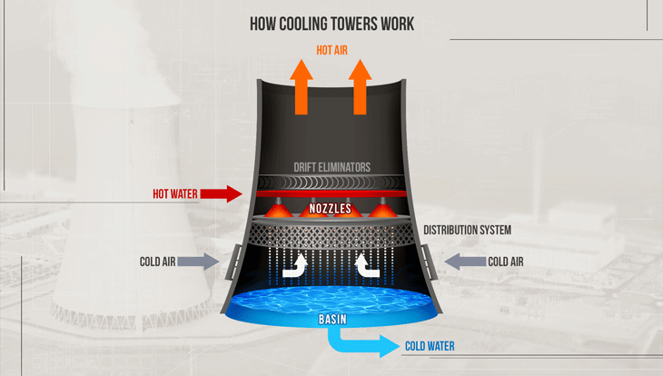
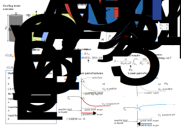
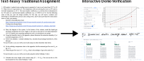
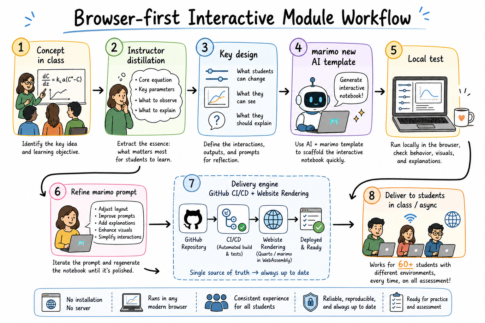

::: {.content-visible when-format="html" unless-format="revealjs"}

::: {.callout-note}
- Interactive Slides 👉  [Open presentation🗒️](./slides.html)
:::

:::


## Learning outcomes {.center}

After this talk, you will be able to:

- **Identify** teaching challenges in equation-heavy engineering courses

- **Describe** how brower-first interactive practice may support exploratiry learning experience

- **Evaluate** how generative AI can be integrated as a course design partner

## Teaching Background {.center}

The materials in this talk are heavily influenced by two of my courses taught in WS 2026:

:::{.columns}

:::{.column width="50%"}

### Mass Transfer (CH E 318)

- Undergrad course
- Topics: diffusion / transport models / process design
- **Equation-heavy**

:::

:::{.column width="50%"}

### Kinetics of Materials (MAT E 664)

- Graduate course
- Topics: thermally-activated processes / rate laws / material transformation
- **Equation-heavy**

:::

:::

## Dilemma in Engineering Teaching {.center}

- Theory and equation heavy courses (**70~80 equations per unit**)
- Textbook concepts are solid, but may appear **lost in equations**
- How can the students understand the "power" of these equations, if we cannot easily show what the equations do?

## Example: Cooling Tower Design (Reality)

{fig-align="center" width="1600px"}

## Example: Cooling Tower Design (Textbook)

{fig-align="center" width="1600px"}

{fig-align="center" width="1600px"}

## Example: Cooling Tower Design (Distilled Textbook)

{fig-align="center" width="1600px"}

## EDI Perspective for Numerical Demonstration

- My philosophy as a computational chemical engineer: **good equations can always be coded.**

- But how do I ensure students can access the same level of insight?

  - **Equity**: No "it doesn’t run on my computer."

  - **Inclusiveness**: Students without coding experience can still interact!

  - **Diversity**: multilevel engagement!
  
    - interact with the UI
    - explore  the code
    - modify the code

## Different Approaches in Numerical Demonstration (Python)

:::{.columns}

:::{.column width="33%"}

### Code-first

{height="96px"}

- Just give students the Python code and ask them to run it.
- **It doesn't work on mine!**


:::

:::{.column width="33%"}

### Notebook-first

{height="96px"}

- Jupyter Notebook / Google Colab
- Students may be lost in heavy codes
- **Requires setup of server / account**


:::

::: {.column width="33%"}

### Interaction-first

{height="96px"}

- Marimo notebooks in WebAssembly
- No registration / server
- **Everything runs on local browser**


::: 

:::

## Interactive Demo

::: {.content-visible when-format="revealjs"}

{.absolute
     top="15" right="15" width="170px" }

:::

```{=html}
<iframe src="../scripts/L31_enthalpy_chart_full.html" width="100%" height="780" style="border: 0; border-radius: 12px;" allowfullscreen></iframe>
```


## Integration into Assessments {.center}

{width="1600px" fig-align="center"}

## Integrating GenAI In The Loop

{width="1600px" fig-align="center"}

## Student Testimonials (Midterm SPOT Survey) {.center}

- *You should continue using your interactive lecture website.*
- *... The interactive questions help keep the class engaged and provide useful feedback
on which topics may need further clarification ...*
- *... Simulations are great and
pretty new to see – not many courses incorporate interactive elements like that ...*

## Other Thoughts {.center}

- **Quantification**: do students really benefit from the interactive demos?
- **Usage metrics**: how do I know my students really used my demos?
- **Further AI integration**: can I have a side-by-side AI chatbot to explain the codes?

## Demo Materials {.center}

:::{.columns}

:::{.column width="45%"}

### Demo Website

{fig-align="center" width="250px"}

:::

:::{.column width="55%"}

### What you can explore

- Similar layout to my classes taught in WS 2026
- Interactive marimo examples
- Browser-first teaching workflow

[Open demo website](https://tiangroup-uofa.github.io/FoTL26_demo/)

[Github Repo](https://github.com/tiangroup-uofa/FoTL26_demo)

Follow us  `tiangroup-uofa`

:::

:::

## Thank You! {.center}

